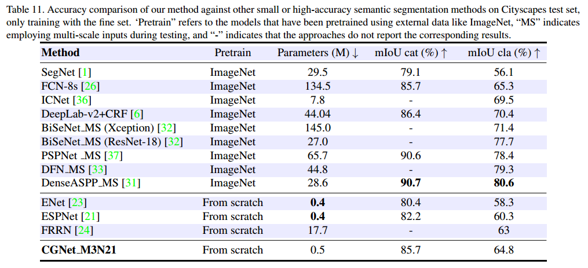
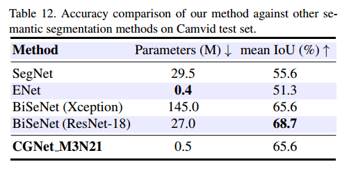

# [CGNet: A Light-weight Context Guided Network for Semantic Segmentation](https://arxiv.org/pdf/1811.08201.pdf)
## Introduction
The demand of applying semantic segmentation model on mobile devices has been increasing rapidly. Current state-of-the-art networks have enormous amount of parameters hence unsuitable for mobile devices, while other small memory footprint models ignore the inherent characteristicof semantic segmentation. To tackle this problem, we propose a novel Context Guided Network (CGNet), which is a light-weight network for semantic segmentation on mobile devices. We first propose the Context Guided (CG) block, which learns the joint feature of both local feature and surrounding context, and further improves the joint feature with the global context. Based on the CG block, we develop Context Guided Network (CGNet), which captures contextual information in all stages of the network and is specially tailored for increasing segmentation accuracy. CGNet is also elaborately designed to reduce the number of parameters and save memory footprint. Under an equivalent number of parameters, the proposed CGNet significantly outperforms existing segmentation networks. Extensive experiments on Cityscapes and CamVid datasets verify the effectiveness of the proposed approach. Specifically, without any post-processing, CGNet achieves 64.8% mean IoU on Cityscapes with less than 0.5 M parameters, and has a frame-rate of 50 fps on one NVIDIA Tesla K80 card for 2048 × 1024 high-resolution images.


## [Results on Cityscapes test set](https://www.cityscapes-dataset.com/method-details/?submissionID=2095&back=mysubmissions) 
We train the proposed CGNet with only fine annotated data and submit our test results to the official evaluation server.


## Results on Camvid test set
We use the training set and validation set to train our model. Here, we use 480×360 resolution for training and evaluation. The number of parameters of CGNet is close to the current smallest semantic segmentation model [ENet ](https://arxiv.org/abs/1606.02147), and the accuracy of our proposed CGNet is 14.3% higher than it.



## Installation
1. Install PyTorch
  - The code is developed on python3.6.5 on Ubuntu 16.04. (GPU: Tesla K80; PyTorch: 0.5.0a0+9b0cece; Cuda: 8.0)
2. Clone the repository
   ```shell
   git clone https://github.com/wutianyiRosun/CGNet.git 
   cd CGNet
   ```
3. Dataset

  - Download the [Cityscapes](https://www.cityscapes-dataset.com/) dataset and convert the dataset to [19 categories](https://github.com/mcordts/cityscapesScripts/blob/master/cityscapesscripts/helpers/labels.py). 
  - Download the [Camvid](https://github.com/alexgkendall/SegNet-Tutorial/tree/master/CamVid) dataset.

## Train your own model
  
###  For Cityscapes
  1. training on train set
  ```
  python cityscapes_train.py --gpus 0,1 --dataset cityscapes --train_type ontrain --train_data_list ./dataset/list/Cityscapes/cityscapes_train_list.txt --max_epochs 300
  ```
  
  2. training on train+val set
  ```
  python cityscapes_train.py --gpus 0,1 --dataset cityscapes --train_type ontrainval --train_data_list ./dataset/list/Cityscapes/cityscapes_trainval_list.txt --max_epochs 350
  ```
  3. Evaluation (on validation set)
 
  ```
  python cityscapes_eval.py --gpus 0 --val_data_list ./dataset/list/Cityscapes/cityscapes_val_list.txt --resume ./checkpoint/cityscapes/CGNet_M3N21bs16gpu2_ontrain/model_cityscapes_train_on_trainset.pth
  ```
  
  - model file download: [model_cityscapes_train_on_trainset.pth](https://pan.baidu.com/s/1rilPxLqBH57_sLg0Lc1--Q)
  
  4. Testing (on test set)
  ```

  python cityscapes_test.py --gpus 0 --test_data_list ./dataset/list/Cityscapes/cityscapes_test_list.txt --resume ./checkpoint/cityscapes/CGNet_M3N21bs16gpu2_ontrainval/model_cityscapes_train_on_trainvalset.pth

  ```
  - model file download: [model_cityscapes_train_on_trainvalset.pth](https://pan.baidu.com/s/1x7LEunjweoDvb_-xNQmFAg)
  
###  For Camvid
  1. training on train+val set
   ```
  python camvid_train.py
  ```
  2. testing (on test set)
  ```
  python camvid_test.py
  ```
  
  - model file download: [model_camvid_train_on_trainvalset](https://pan.baidu.com/s/1gH6pI3jFmtlBgjgLUCjVvA)
